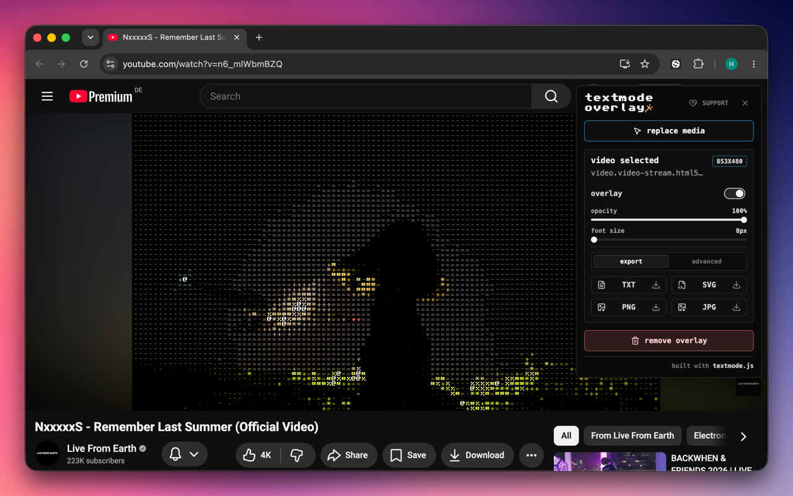
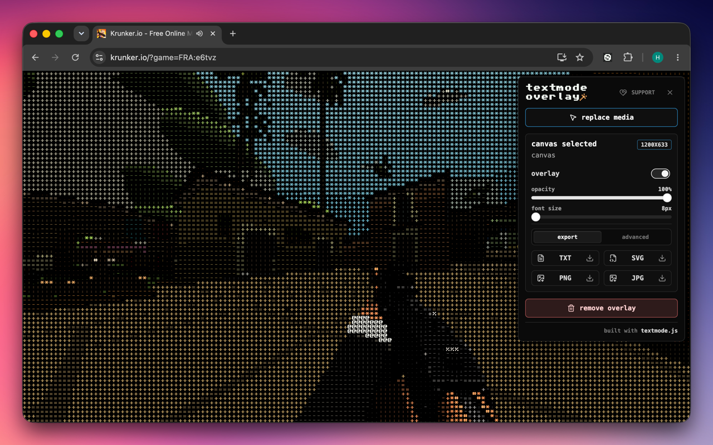
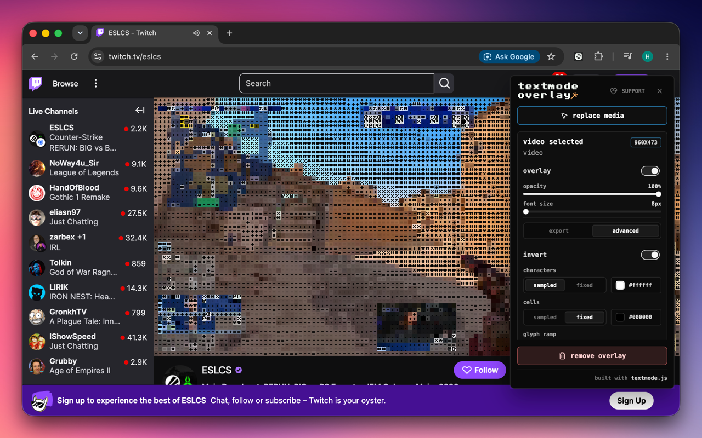

# Textmode Overlay ⊂(◉‿◉)つ

<div align="center">

<table>
  <tr>
    <td></td>
    <td></td>
    <td></td>
  </tr>
</table>

<p align="center">
  <a href="https://www.typescriptlang.org/"></a><!--
  --><a href="https://wxt.dev/"></a><!--
  --><a href="https://vite.dev/"></a>
  &nbsp;&nbsp;
  <!--
  --><!--
  --><!--
  -->
  &nbsp;&nbsp;
  <a href="https://ko-fi.com/V7V8JG2FY"></a><!--
  --><a href="https://github.com/sponsors/humanbydefinition"></a>
</p>

</div>

`Textmode Overlay` is a free and open-source browser extension utilizing [textmode.js](https://github.com/humanbydefinition/textmode.js) to render live ASCII/textmode overlays on visible `<canvas>` and `<video>` elements. It provides an in-page control panel for adjusting overlay settings, applying real-time post-processing filters, uploading custom fonts, and exporting the result as TXT, SVG, PNG, or JPG.

## Features

- **Live Textmode Conversion**: Real-time rendering of customizable textmode/ASCII grids over `<canvas>` and `<video>` elements.
- **In-Page Control Panel**: Dynamic options for adjustments to characters, fonts, glyph sizes, post-fx filters, and more.
- **Custom Fonts**: Upload your own TrueType (`.ttf`) or OpenType (`.otf`) fonts directly in the control panel to use custom character sets.
- **Post-FX Filters**: Stackable, real-time filters to stylize the final output.
- **Static Exports**: Export overlays as TXT, SVG, PNG, or JPG when you want a static copy of the canvas.

## Browser Support

| Browser                                               | Build                   | Output                     | Store                                                                                                          |
| ----------------------------------------------------- | ----------------------- | -------------------------- | -------------------------------------------------------------------------------------------------------------- |
| [Chrome](https://www.google.com/chrome/)              | `npm run build:chrome`  | `.output/chrome-mv3`       | [Chrome Web Store](https://chromewebstore.google.com/detail/textmode-overlay/nmepplnokndndgeldlhbffhkipimmaia) |
| [Opera](https://www.opera.com/download)               | `npm run build:opera`   | `.output/chrome-mv3-opera` | [Opera Add-ons](https://addons.opera.com/en/extensions/details/textmode-overlay/)                              |
| [Edge](https://www.microsoft.com/en-us/edge)          | `npm run build:edge`    | `.output/edge-mv3`         | [Edge Add-ons](https://microsoftedge.microsoft.com/addons/detail/plmdfppaobnppibihdkfgoaeikehofjf)             |
| [Firefox](https://www.mozilla.org/en-US/firefox/new/) | `npm run build:firefox` | `.output/firefox-mv3`      | [Firefox Add-ons](https://addons.mozilla.org/en-US/firefox/addon/textmode-overlay/)                            |
| [Safari](https://www.apple.com/safari/)               | `npm run build:safari`  | `.output/safari-mv2`       | —                                                                                                              |

## Quick Start

Requirements:

- [Node.js](https://nodejs.org/en/download) 20.8.1 or newer
- npm
- [Chrome](https://www.google.com/chrome/) or another [Chromium](https://www.chromium.org/getting-involved/download-chromium/) browser for local MV3 testing

Install dependencies:

```sh
npm install
```

Run the full verification pipeline:

```sh
npm run check
```

Build the unpacked Chrome extension:

```sh
npm run build:chrome
```

Load the extension in Chrome:

1. Open `chrome://extensions`.
2. Enable Developer mode.
3. Click **Load unpacked**.
4. Select `.output/chrome-mv3`.

## Usage

1. Open a [page](https://www.youtube.com/watch?v=dQw4w9WgXcQ) with a visible canvas or video element.
2. Click the textmode overlay extension action.
3. Click **select media**.
4. Click the target media element on the page.
5. Adjust the overlay settings from the in-page panel.
6. Export the result when you want a static artifact.

> [!NOTE]
> Some media cannot be sampled. Cross-origin, tainted, DRM-protected, or otherwise restricted media may fail when the browser blocks WebGL or canvas pixel access. The extension should report those failures without breaking the page.

### Uploading Fonts

Open the font picker from the in-page panel and choose **upload font...** to add a local TrueType `.ttf` or TrueType-outline `.otf` font. Uploaded fonts are session-only: they stay available while the content runtime is alive, but they are not persisted after page reloads or navigation. WOFF, WOFF2, CFF-based OTF files, and files larger than 10 MB are rejected.

### Post-FX Filters

The extension includes a powerful, real-time post-processing stack that can be enabled and configured from the in-page control panel:

- **Built-in Effects**:
    - **Invert**: Invert the colors of the final textmode output.
    - **Grayscale**: Adjust the strength of the grayscale filter.
    - **Sepia**: Blend the output with sepia tones.
    - **Threshold**: Convert the output to hard black and white bands.
- **Color Correction**:
    - **Brightness**: Multiply final output brightness.
    - **Contrast**: Scale contrast around the midpoint.
    - **Saturation**: Tweak color intensity without shifting luminance.
    - **Hue Rotate**: Rotate the colors around the color wheel.
    - **Posterize**: Reduce colors into distinct channel bands.
- **Distortion**:
    - **Chromatic Aberration**: Separate red, green, and blue channels in a configurable direction.
    - **Pixelate**: Apply a classic retro mosaic-style pixel-block effect.
- **Stylization**:
    - **CRT Mattias**: Simulate retro tube screen curvature and scanning lines.
    - **Scanlines**: Add horizontal CRT scanlines with configurable intensity, count, and scroll speed.
    - **Vignette**: Darken the edges of the screen with adjustable softness and roundness.
    - **Bloom**: Create a soft, glowing halo effect around bright regions.
    - **Film Grain**: Inject animated film grain for a gritty, cinematic texture.

## Development

Development workflow, testing, architecture, and contribution guidelines live in
[CONTRIBUTING.md](CONTRIBUTING.md).

## License

`Textmode Overlay` is licensed under the [MIT License](LICENSE).
