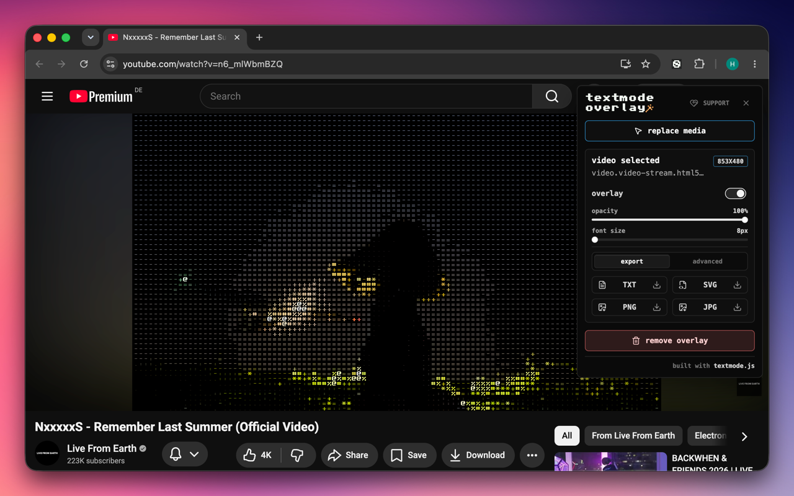
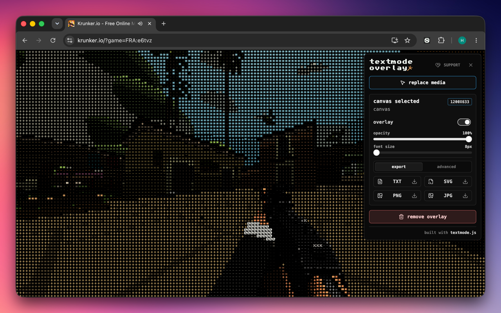
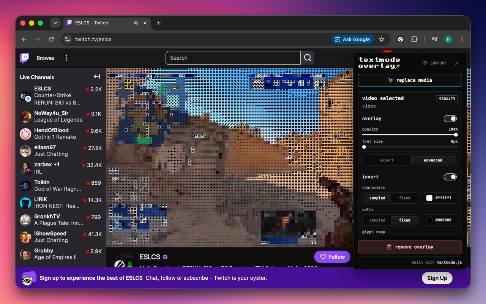

# Textmode Overlay ⊂(◉‿◉)つ

<div align="center">

<table>
  <tr>
    <td></td>
    <td></td>
    <td></td>
  </tr>
</table>

<p align="center">
  <a href="https://www.typescriptlang.org/"></a><!--
  --><a href="https://wxt.dev/"></a><!--
  --><a href="https://vite.dev/"></a>
  &nbsp;&nbsp;
  <!--
  --><!--
  --><!--
  -->
  &nbsp;&nbsp;
  <a href="https://ko-fi.com/V7V8JG2FY"></a><!--
  --><a href="https://github.com/sponsors/humanbydefinition"></a>
</p>

</div>

`Textmode Overlay` is a free, open-source browser extension built with [textmode.js](https://github.com/humanbydefinition/textmode.js). It turns compatible `<canvas>` and `<video>` elements into live ASCII/textmode overlays that you can style, adjust, and export.

## Features

- **Live conversion**: Render a customizable ASCII grid over a compatible canvas or video.
- **Media picker**: Select visible media in the page, including supported same-origin and nested frames.
- **Visual controls**: Adjust brightness, contours, colors, glyph ramps, fonts, opacity, and post-processing effects.
- **Custom fonts**: Upload local `.ttf` or `.otf` fonts for your own character style.
- **Exports**: Save a frame as TXT, SVG, PNG, or JPG.

## Browser Support

| Browser                                               | Build                   | Output                     | Store                                                                                                          |
| ----------------------------------------------------- | ----------------------- | -------------------------- | -------------------------------------------------------------------------------------------------------------- |
| [Chrome](https://www.google.com/chrome/)              | `npm run build:chrome`  | `.output/chrome-mv3`       | [Chrome Web Store](https://chromewebstore.google.com/detail/textmode-overlay/nmepplnokndndgeldlhbffhkipimmaia) |
| [Opera](https://www.opera.com/download)               | `npm run build:opera`   | `.output/chrome-mv3-opera` | [Opera Add-ons](https://addons.opera.com/en/extensions/details/textmode-overlay/)                              |
| [Edge](https://www.microsoft.com/en-us/edge)          | `npm run build:edge`    | `.output/edge-mv3`         | [Edge Add-ons](https://microsoftedge.microsoft.com/addons/detail/plmdfppaobnppibihdkfgoaeikehofjf)             |
| [Firefox](https://www.mozilla.org/en-US/firefox/new/) | `npm run build:firefox` | `.output/firefox-mv3`      | [Firefox Add-ons](https://addons.mozilla.org/en-US/firefox/addon/textmode-overlay/)                            |
| [Safari](https://www.apple.com/safari/)               | `npm run build:safari`  | `.output/safari-mv2`       | —                                                                                                              |

## Quick Start

Requirements:

- [Node.js](https://nodejs.org/en/download) 20.8.1 or newer
- npm
- [Chrome](https://www.google.com/chrome/) or another [Chromium](https://www.chromium.org/getting-involved/download-chromium/) browser for local MV3 testing

Install dependencies:

```sh
npm install
```

Run the full verification pipeline:

```sh
npm run check
```

Build the unpacked Chrome extension:

```sh
npm run build:chrome
```

Load the extension in Chrome:

1. Open `chrome://extensions`.
2. Enable Developer mode.
3. Click **Load unpacked**.
4. Select `.output/chrome-mv3`.

## Custom fonts

Upload a local TrueType (`.ttf`) or OpenType (`.otf`) font from the in-page panel. Fonts stay in the current browser profile; they are not synced or uploaded. Files over 10 MB are rejected, and the extension supports up to 10 fonts and 50 MB of font data in total.

## Privacy

Textmode Overlay accesses a page only after you invoke it from the toolbar or context menu. Rendering, settings, fonts, and exports stay in your browser. The extension has no backend, account synchronization, analytics, advertising, or remote telemetry, and it does not transmit page content or exports.

The extension uses `activeTab`, `contextMenus`, `scripting`, `storage`, and `unlimitedStorage`. It does not request permanent host permissions.

See the [Imprint](https://legal.textmode.art/projects/extension.textmode.art/en/imprint) and [Privacy Policy](https://legal.textmode.art/projects/extension.textmode.art/en/privacy) for the complete disclosures covering the extension and extension.textmode.art landing page.

## Usage

1. Open a [page](https://www.youtube.com/watch?v=dQw4w9WgXcQ) with a visible canvas or video element.
2. Click the Textmode Overlay toolbar icon, or right-click the page and choose **Open Textmode Overlay**.
3. In the panel, choose **select media**, then click a highlighted canvas or video.
4. Adjust the effect or export a frame from the panel.

> [!NOTE]
> Some media cannot be sampled. Cross-origin, tainted, DRM-protected, or otherwise restricted media may fail when the browser blocks WebGL or canvas pixel access.

### Uploading Fonts

Open the font picker from the in-page panel and choose **upload font...** to add a local TrueType `.ttf` or TrueType-outline `.otf` font. Uploaded fonts are persisted in browser-managed extension storage and remain available after page reloads or navigation until you remove them, clear the extension data, or uninstall the extension. WOFF, WOFF2, CFF-based OTF files, and files larger than 10 MB are rejected.

### Post-FX Filters

Open the in-page control panel, switch to the **post fx** tab, and use that list to shape the final rendered output. Each row can be enabled or disabled, expanded to reveal its controls, and dragged by the grip handle to change the order in which the filters run.

The stack is applied from top to bottom, so reordering filters can change the final look even when the same filters stay enabled. When a filter has adjustable properties, expand its row and update the available sliders or numeric controls directly from that panel.

## Development

Development workflow, testing, architecture, and contribution guidelines live in
[CONTRIBUTING.md](CONTRIBUTING.md).

## License

`Textmode Overlay` is licensed under the [MIT License](LICENSE).
